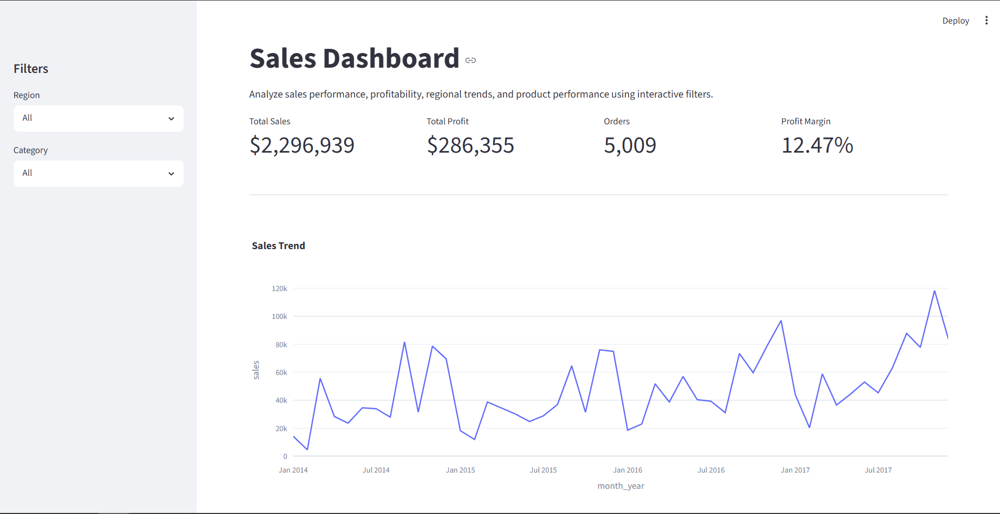
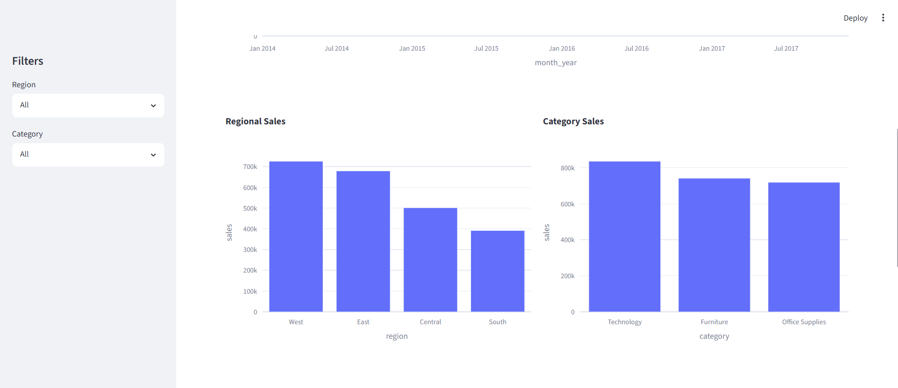
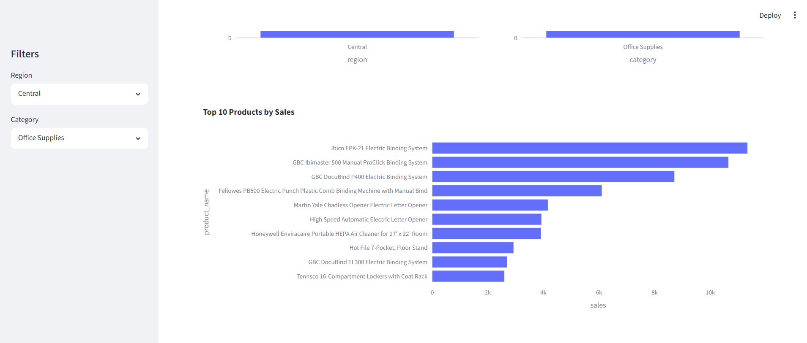
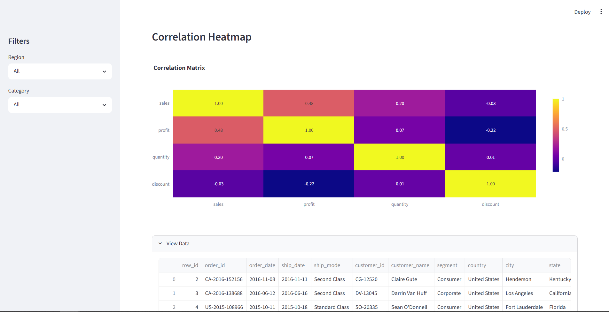

# Sales Dashboard Analytics Project

## Project Overview

This project analyzes the sales data of an ecommerce store named "Superstore". It aims to identify business trends, product performance, regional profitability and related info.

It follows an analytical workflow, including -

- Data Cleaning
- Exploratory Data Analysis
- Data Visualization
- Dashboard Development

The final outcome is an interactive dashboard and important insights that help the business make data-driven decisions.

## Objectives

- Analyze sales and profit performance throughout years
- Identify top-performing products
- Evaluate regional performance
- Discover business trends
- Build an interactive dashboard

## Technologies Used

- Python
- Pandas
- NumPy
- Matplotlib
- Streamlit + Plotly
- Jupyter Notebook

## Dataset

The dataset has been derived from Kaggle. It contains transactional sales records including:

- Order Date
- Sales
- Profit
- Product Category
- Region
- Customer Segment, etc.

The data was cleaned and transformed before analysis.

## Dashboard Preview

### Front Page / Sales Trends



### Regional / Categorical Analysis



### Top Products



### Correlational Analysis



## Some Business Insights

- Sales and profits peak during year-end months.
- Some top-selling products are unprofitable.
- West and East are the strongest-performing regions.
- Smaller cities offer growth opportunities.
- Excessive discounting negatively impacts profit margins.

## Installation

### 1. Clone the Repository

```bash
git clone https://github.com/shree-444/sales-dashboard-project.git
cd sales-dashboard-project
```

### 2. Create a Virtual Environment

```bash
python -m venv venv
```

### 3. Activate the Virtual Environment

#### Windows

```bash
venv\Scripts\activate
```

#### macOS/Linux

```bash
source venv/bin/activate
```

### 4. Install Dependencies

```bash
pip install -r requirements.txt
```

### 5. Run the Dashboard

```bash
streamlit run dashboard.py
```

### 6. Open in Browser

After running the above command, Streamlit will automatically provide a local URL. Open it in your browser to view the dashboard.

```text
http://localhost:8501
```